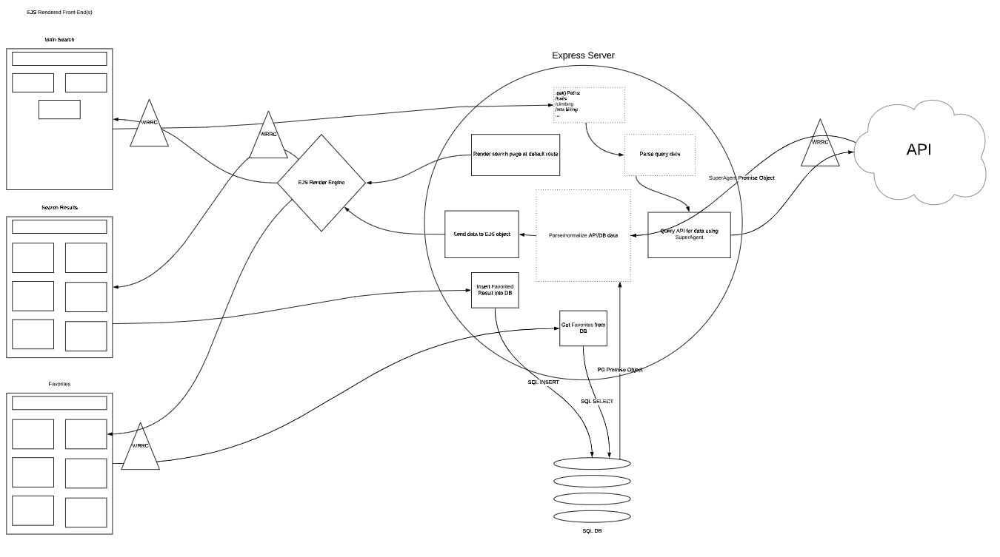

# Code-301-Final-Project
Code 301 Final Project

## Created by: Christopher Hamersly, Paul Rest, Stephen Baldock, and Daisy Johnson

## Overall problem domain and how this project solves those problems:
The user has a limited amount of time and wants to get the most out their weekend. This app gives you options to fill up the time you have available, whether it be a lot or a little making you a true weekend warrior. This website will be a one-stop-shop to give all the information you need like trail guides, playlists that match your adventure and restaurant recommendations etc.

## summary of project: A web-app to help you figure out the best way to spend your weekend outside.

## Version
1.0 - 

## Change Log
 - 06-15-2020 1800 Add Book api and basic layout of routes and CSS.
 - 06-16-2020 1800 Add SQL db to persist user book selections, Add detailed view for books in collection.
 - 06-17-2020 1500 Add ability to update and remove items from database from the detailed view of individual books.
 - 06-17-2020 1700 Add ability to search by author from the database/

## Architecture
Backend utilizes superagent for API calls to googlebooks API and postgres to query a SQL database. Frontend is served with EJS components.

## WireFrame


## Domain Model



## Libraries Used:
 - Express
 - EJS
 - dotenv
 - superagent
 - pg
 
 ## API Endpoints
**Climbing Routes API by lat & lon**
https://www.mountainproject.com/data/get-routes-for-lat-lon?lat=40.03&lon=-105.25&maxDistance=10&minDiff=5.6&maxDiff=5.10&key=200790534-05370a505ab38e493dbb8b4c24c7dadd
**Hiking Routes API by lat & lon**
https://www.hikingproject.com/data/get-trails?lat=40.0274&lon=-105.2519&maxDistance=10&key=200790534-badad5b9f2f1c28cff7c1bd0f669131e
**Trail Running API by lat & lon**
https://www.trailrunproject.com/data/get-trails?lat=40.0274&lon=-105.2519&maxDistance=10&key=200790534-badad5b9f2f1c28cff7c1bd0f669131e


## Database Schemas and Relationship Diagram
SQL Tables - MVP
* **Hiking**
 * Key | Image | Trail Name | Latitude | Longitude | Distance | Total Elevation | Difficulty Rating | Condition Status | Reviews 
* **Camping**
 * Key | Image | Campground Name | Latitude | Longitude | Description | Firewood | Restrooms | Reservations | Fees | Potable Water | Accessibility
* **Rock Climbing**
 * Key | Image | Name | Latitude | Longitude | Type | Pitches | Stars 
* **Location ID**
 * Key | Search_Query | Formatted_Query | Latitude | Longitude


SQL Tables - Stretch Goals (TBD)
* **Restaurants**

* **Music**


## Getting Started

### Step 1:
Once you have cloned the repo in the command line run:
```console
$ npm i
$ touch .env
```
### Step 2:
In the directory open the **.env** file and insert the following:
 - openport should be a number for an open port on your machine.
```
PORT=<openport>
DATABASE=db-url
```
### Step 3:
From the root directory on the command like run the following commands:
```console
$ psql
```
```sql
# CREATE DATABASE dbname;
# \q
```
```console
$ psql -d dbname -f schema.sql
$ psql -d dbname -f seed.sql
```
### Step 4:
To start the server run the following in the terminal:
```console
$ npm start
```
